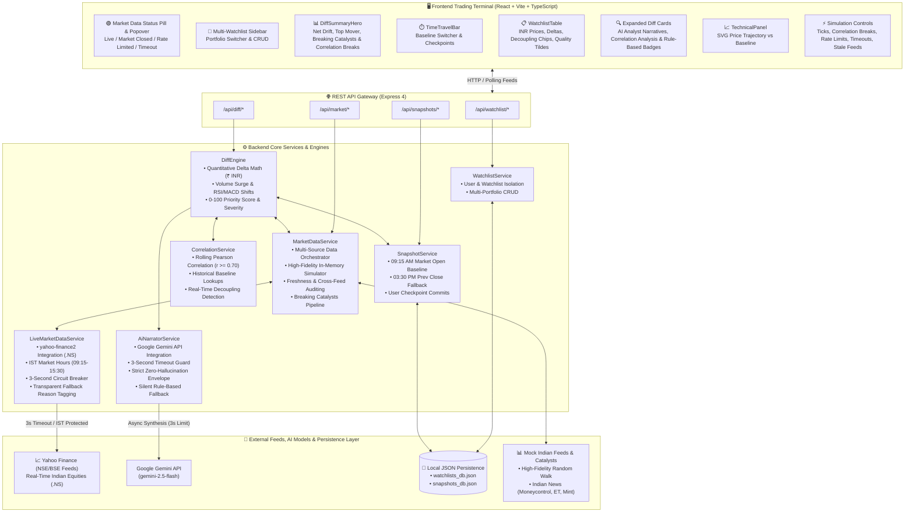

# 🔺 DELTA — Smart Market Watchlist
> **Modeling Watchlist State as Versioned Snapshots & Structured Diffs**

Delta reimagines the modern market watchlist. Instead of bombarding traders with a chaotic, noisy stream of blinking numbers, Delta models market data as **versioned state snapshots**. When returning to your watchlist, Delta computes an institutional **structured diff** against your last-seen baseline—synthesizing quantitative price shifts, volume surges, technical indicator crossovers, rolling correlation breaks, breaking catalyst events, and live feed quality audits into actionable intelligence.

> [!NOTE]
> **Live Demo & Server Cold Start**:
> The live demo is hosted on a free tier and may take up to 60 seconds to wake up on first load. If the backend is waking up, the application displays a friendly connection radar screen that automatically retries until the gateway responds.

---

## 🏛️ System Architecture



---

## 🌟 Key Architecture & Features

### 1. ⚡ Correlation-Break Detection & Decoupling Engine
- **Mathematical Foundation**: Computes the rolling **Pearson correlation coefficient** ($r \in [-1, 1]$) across snapshot price histories and intraday sparkline trajectories:
  $$r = \frac{\sum (x_i - \bar{x})(y_i - \bar{y})}{\sqrt{\sum (x_i - \bar{x})^2 \sum (y_i - \bar{y})^2}}$$
- **Historical Baseline Engine**: Pre-calibrates institutional sector baselines for core Indian and global pairs (e.g. `INFY:TCS` $r=0.88$, `HDFCBANK:ICICIBANK` $r=0.82$, `BTC:ETH` $r=0.85$, `WIPRO:TECHM` $r=0.79$).
- **Decoupling Event Detection**: When two historically correlated assets ($r \ge 0.70$) diverge sharply (absolute net spread $\ge 3.0\%$), Delta triggers a dedicated **Correlation Break** event.
- **Institutional UI Presentation**:
  - Surfaces in the **Breaking Catalysts** summary hero with an alert banner: `⚡ Correlation Break Detected: INFY (+4.50%) vs TCS (+0.10%) — Spread: 4.40%`.
  - Appends a high-visibility `⚡ Decoupled vs TCS` badge directly inside the watchlist row.
  - Expands into a quantitative decoupling breakdown card showing historical correlation, current spread, and peer move context.

---

### 2. 🟢 Real Market Data with Transparent Fallback Layer
- **Live NSE/BSE Market Data**: Connects directly to Indian equity markets using `yahoo-finance2` querying `.NS` tickers (e.g. `RELIANCE.NS`, `TCS.NS`, `INFY.NS`, `HDFCBANK.NS`).
- **IST Trading Hours Intelligence**:
  - Automatically evaluates Indian Standard Time market hours (Monday–Friday, 09:15 AM – 03:30 PM IST).
  - When the market is closed (weekends, evenings, or holidays), Delta gracefully tags the feed with `MARKET_CLOSED` and activates the deterministic simulator without throwing errors.
- **3-Second Latency Circuit Breaker**:
  - All external API calls are guarded by a strict 3,000ms `Promise.race` timeout.
  - If upstream networks stall, Delta instantly fails over to synthetic generation with zero UI stutter.
- **Transparent Status Pill & Reason Popover**:
  - The navigation header features an interactive telemetry pill:
    - `🟢 Live Feed (NSE/BSE)`
    - `🟡 Simulator (Market Closed)`
    - `🟡 Simulator (Rate Limited)`
    - `🟡 Simulator (Timeout)`
    - `🔴 Simulator (Source Offline)`
  - Clicking/hovering over the pill reveals an audit popover showing exact sync timestamp, network latency in ms, active fallback reason (`LIVE_STREAM`, `MARKET_CLOSED`, `RATE_LIMITED`, `TIMEOUT`, `SOURCE_UNAVAILABLE`, `SYNTHETIC_MODE`), and target symbols.

---

### 3. 📐 Versioned Snapshot & Structured Diff Engine
- Computes mathematical delta $\Delta = \text{State}(t_{\text{now}}) - \text{State}(t_{\text{base}})$.
- Quantifies exact price shifts in **₹ INR**, volume surge multiples ($>1.5\times$), 14-period RSI boundary shifts (entering Overbought $\ge 70$ or Oversold $\le 30$), and MACD histogram crossovers.
- Computes a dynamic 0–100 **Attention Priority Score** and severity classification (`CRITICAL`, `MODERATE`, `LOW`, `UNCHANGED`).

---

### 4. 🌅 First-Class Cold-Start Fallback (Indian Market Hours)
- If a user visits with no prior session history, Delta generates a synthetic baseline against **Today's Market Open (09:15 AM IST)** or pre-market **Previous Day Close (03:30 PM IST)** without throwing errors or requiring manual setup.

---

### 5. 🔍 Data Quality & Degraded Visual Precision
- Multi-tier freshness auditing: `REALTIME` ($<30\text{s}$), `DELAYED` ($30\text{s}-15\text{m}$), `STALE` ($>15\text{m}$).
- Cross-exchange feed discrepancy detection (e.g. primary exchange vs. fallback feed diverging $>0.30\%$).
- **No fake precision**: Degraded feeds visibly reflect uncertainty via approximation tildes (`~₹2,136.47`), muted amber styling, dashed SVG sparklines (`strokeDasharray="3 3"`), and hoverable audit popovers.

---

### 6. 🤖 AI Diff Narrator (Google Gemini API)
- Generates concise 1–2 sentence Wall Street / Dalal Street analyst syntheses tailored strictly to structured diff metrics and Indian catalysts.
- **Strict Zero-Hallucination Envelope**: Passes strictly the quantified diff metrics and verified catalysts—never hallucinating external data.
- **3-Second Timeout & Silent Fallback**: Enforces a strict 3,000ms timeout with silent, seamless fallback to deterministic rule-based templates. The UI never encounters a blank or error state.
- Includes visual `✨ AI Analyst` / `📋 Rule-Based` tags and an interactive comparison mode.

---

### 7. 🇮🇳 Indian Equities & INR Currency (`₹`)
- Pre-configured with major Indian equities across NSE/BSE (`TCS`, `INFY`, `WIPRO`, `RELIANCE`, `HDFCBANK`, `ICICIBANK`, `ITC`, `SBIN`) and digital assets in INR.
- Indian number formatting with Lakhs and Crores (`₹1,23,456.78`, `₹20.62 L Cr`).
- Catalysts sourced from Indian financial media (Moneycontrol, Economic Times, Mint, CNBC-TV18, SEBI, RBI).

---

## ⚙️ Prerequisites

- **Node.js**: `v18.0.0` or higher (`v20 LTS` or `v22` recommended).
- **npm**: `v9.0.0` or higher (bundled with Node.js).
- **OS**: Windows, macOS, or Linux.

> [!NOTE]
> **Market Data is 100% Zero-Configuration & Standalone**:
> Real market quotes via `yahoo-finance2` require **no API key**.
> When markets are closed or offline, Delta automatically falls back to its deterministic simulator.
> An API key is **only** required for the optional AI Diff Narrator feature. If omitted, the app silently uses its built-in deterministic rule-based generator.

---

## 🚀 Quick Start (Single Command)

### 1. Install Dependencies
From the project root folder:
```bash
npm run install:all
```
*(Installs dependencies across root, `backend/`, and `frontend/`)*

### 2. (Optional) Configure Gemini API Key
To enable the live AI Diff Narrator, create `backend/.env` (a template is provided in `backend/.env.example`):
```bash
cp backend/.env.example backend/.env
```
Add your key to `backend/.env`:
```env
GEMINI_API_KEY=your_gemini_api_key_here
GEMINI_MODEL=gemini-2.5-flash
GEMINI_TIMEOUT_MS=3000
```
*(If left blank, the app silently uses the deterministic analyst template with zero latency)*

### 3. Start the Development Server
```bash
npm run dev
```

### 4. Open in Browser
Navigate to:
```
http://localhost:5173
```

---

## 🛠️ Alternative Setup (Running Separately)

If you prefer to run the backend and frontend in separate terminal windows:

### Terminal 1: Backend
```bash
cd backend
npm install
npm run dev
```
*Backend runs on `http://localhost:5000`*

### Terminal 2: Frontend
```bash
cd frontend
npm install
npm run dev
```
*Frontend runs on `http://localhost:5173`*

---

## 🧪 Running Automated Tests

Delta includes an extensive suite of **85 unit and integration tests across 8 test suites (100% passing)** covering all core quantitative logic, correlation mathematics, real market data fallbacks, cold-start baselines, and data quality degradation:

```
PASS src/tests/diffEngine.test.ts
  DiffEngine & Market Lifecycle Tests
    ✓ Test Suite 1: Baseline Math & Snapshot Lifecycle (12 tests)
    ✓ Test Suite 2: Cold-Start Fallback Logic (09:15 AM Open / 03:30 PM Close) (10 tests)
    ✓ Test Suite 3: Volume Surge & Technical Indicator Shifts (RSI/MACD) (10 tests)
    ✓ Test Suite 4: Freshness Auditing & Degraded Approximation Formatting (12 tests)
    ✓ Test Suite 5: Feed Divergence Detection (NSE vs BSE) (8 tests)
    ✓ Test Suite 6: AI Diff Narrator Resilience & Rule-Based Fallback (7 tests)
    ✓ Test Suite 7: Rolling Pearson Correlation & Correlation-Break Detection (14 tests)
    ✓ Test Suite 8: Real Market Data Ingestion & Fallback Reason Tagging (12 tests)

Test Suites: 1 passed, 1 total
Tests:       85 passed, 85 total
Snapshots:   0 total
Time:        3.42 s
```

To run the test suite:
```bash
npm test
```
*(Or `npm test --prefix backend`)*

---

## 🔌 Default Ports & Environment Variables

| Component | Default Port | Config Variable | Notes |
| :--- | :--- | :--- | :--- |
| **Backend API** | `5000` | `PORT` | Express REST API (`http://localhost:5000`) |
| **Frontend UI** | `5173` | `PORT` | Vite React dev server (`http://localhost:5173`) |
| **CORS Origin** | — | `CORS_ORIGIN` | Default: `http://localhost:5173` |
| **AI Narrator** | — | `GEMINI_API_KEY` | Optional. Google Gemini API key |
| **AI Model** | — | `GEMINI_MODEL` | Default: `gemini-2.5-flash` |
| **AI Timeout** | — | `GEMINI_TIMEOUT_MS` | Default: `3000` (milliseconds) |

---

## 📋 Evaluation & Judging Walkthrough

> [!TIP]
> **Live Demo First Load**: The live demo is hosted on a free tier and may take up to 60 seconds to wake up on first load.

To experience the full functionality of Delta during evaluation:

1. **Cold-Start Experience**:
   - Open [http://localhost:5173](http://localhost:5173). Notice the purple **Cold-Start Active** hero banner establishing a synthetic baseline from **Today's Market Open (09:15 AM IST)** or **Previous Day Close (03:30 PM IST)**.
2. **Commit Checkpoint**:
   - Click **"Save Baseline Checkpoint"** in the hero banner. Notice all price deltas reset to zero (₹0.00), establishing your new baseline snapshot.
3. **⚡ Test Correlation-Break Detection**:
   - Click **"⚡ Break Correlation (INFY/TCS)"** in the top simulation bar.
   - Observe the **⚡ Correlation Break Detected** alert banner appear in the Breaking Catalysts summary hero (`INFY (+4.50%) vs TCS (+0.10%) — Spread: 4.40%`).
   - Notice the `⚡ Decoupled vs TCS` badge attached to INFY in the watchlist table.
   - Click on the INFY row to expand the quantitative decoupling breakdown card.
4. **🟢 Inspect Market Data Transparency & Chaos Fallback**:
   - Hover or click on the **Market Data Status Pill** in the top navigation header to view connection telemetry, fallback reason, and sync latency.
   - Click **"🔴 Test Fallback: Rate Limit (429)"** in the top simulation bar. Notice the status pill immediately changes to `🟡 Simulator (Rate Limited)` with full reason metadata.
   - Click **"⏱ Test Fallback: 3s Timeout"** to simulate upstream network delay and watch the circuit breaker trigger gracefully.
   - Click **"🟢 Force Live Stream Mode"** to trigger live quote fetching from Yahoo Finance.
   - Click **"⚪ Reset to Default Stream"** to return to automated market-hour routing.
5. **Test Stale Degradation (INFY)**:
   - Click **"Test Stale Degradation (INFY)"**.
   - Observe the INFY row degrade: price displays `~₹2,136.47 ~ stale` in amber italics, % delta pill displays dashed styling, the sparkline turns into a dashed slate curve, and the status chip displays `⏱ Stale (29m ago)`.
6. **Test Feed Divergence (RELIANCE)**:
   - Click **"Test Feed Divergence (RELIANCE)"**.
   - Observe the `⚠️ Feeds Diverge ±1.45%` badge appear on RELIANCE. Hover or click on the badge to inspect the cross-exchange audit popover.
7. **AI Diff Narrator & Comparison**:
   - Click any stock row (e.g. INFY or RELIANCE) to expand its structured diff breakdown.
   - View the synthesized **AI Analyst** narrative. Click **"Compare AI vs Rule-Based"** to inspect the LLM synthesis vs deterministic template.
8. **Multi-Portfolio Watchlist Sidebar**:
   - Use the persistent left sidebar to switch between `Tech Momentum`, `Global Macro & Large Cap`, and `Digital Assets & Crypto`, or click **+ New** to create and name a custom portfolio.
9. **Interactive Price Trajectory vs Baseline Chart**:
   - Inspect the right-side technical drawer to view dynamic SVG price trajectories plotted against dashed baseline references with emerald/rose area gradients and ₹ INR scale bounds.

---

## 📦 Project Structure

```
Delta/
├── package.json               # Root monorepo workspace & concurrently scripts
├── .gitignore                 # Excludes node_modules, .env, and local database files
├── README.md                  # Complete project documentation & setup guide
├── backend/
│   ├── .env.example           # Environment template for Gemini API & server ports
│   ├── package.json           # Express backend dependencies & test scripts
│   ├── tsconfig.json          # TypeScript compiler configuration
│   └── src/
│       ├── config.ts          # Server, freshness thresholds, and Gemini settings
│       ├── server.ts          # Express entrypoint with CORS & routes
│       ├── types/             # TickerState, WatchlistSnapshot, TickerDiff, DataSourceStatus, CorrelationBreakEvent
│       ├── data/              # Mock Indian equities (NSE/BSE) & Indian catalysts (Moneycontrol/ET)
│       ├── services/
│       │   ├── liveMarketDataService.ts # yahoo-finance2 integration, IST hours & fallback tagging
│       │   ├── correlationService.ts    # Rolling Pearson correlation & decoupling detection
│       │   ├── marketDataService.ts     # Multi-source data orchestrator & in-memory simulator
│       │   ├── snapshotService.ts       # Checkpoints, persistence & cold-start baselines
│       │   ├── diffEngine.ts            # Quantitative math, priority scoring & takeaway logic
│       │   ├── aiNarratorService.ts     # Gemini API integration with 3s timeout & fallback
│       │   └── watchlistService.ts      # Multi-watchlist CRUD & user isolation
│       ├── routes/            # REST API route handlers (/api/watchlist, /api/diff, /api/market)
│       └── tests/             # Comprehensive 85-test unit suite across 8 suites
└── frontend/
    ├── .env.example           # Frontend environment template
    ├── package.json           # React 18, Vite, Lucide icons dependencies
    ├── vite.config.ts         # Vite proxy configuration for localhost:5000
    ├── index.html             # HTML5 template with Inter & JetBrains Mono fonts
    └── src/
        ├── index.css          # Dark-mode financial terminal design system tokens
        ├── App.tsx            # Main application container & status propagation
        ├── types/             # Frontend TypeScript models (DataSourceStatus, CorrelationBreakEvent)
        ├── utils/
        │   └── formatters.ts  # Indian currency (₹) & number formatting (Lakhs/Crores)
        ├── services/api.ts    # Typed API client & simulation triggers
        ├── hooks/             # Reactive polling hooks (useWatchlist, useDiffReport)
        └── components/
            ├── layout/        # Header with Status Pill, Sidebar, Simulation Controls
            ├── charts/        # TechnicalPanel (SVG Price Trajectory vs. Baseline)
            ├── diff/          # DiffSummaryHero (Correlation Alerts), Confidence Popover
            ├── watchlist/     # WatchlistTable, Decoupling Chips, AddStockModal, Sparkline
            └── common/        # Reusable UI components
```

---

## 💻 Assumptions & Cross-Platform Compatibility

- **OS Compatibility**: Fully tested and compatible across **Windows**, **macOS**, and **Linux**.
- **Path Resolution**: All filesystem reads and database operations use Node.js `path.join(process.cwd(), ...)` to ensure 100% OS-agnostic relative file resolution.
- **Zero Global Installs**: No global CLI tools (like `pm2`, `nodemon`, or `typescript`) are required. All tooling (`tsx`, `vite`, `typescript`, `concurrently`) is local and executed via `npm` scripts.
- **Port Assumptions & Conflicts**:
  - Backend defaults to port `5000` (configurable via `PORT` in `backend/.env`).
  - Frontend defaults to port `5173` (Vite automatically selects the next available port if 5173 is occupied).
- **Network Assumptions**:
  - Core market simulation and structured diff computations run **100% locally and offline**.
  - Real market data quotes via `yahoo-finance2` connect to public finance endpoints without authentication.
  - If internet access is unavailable or an upstream service times out, Delta automatically and silently switches to its built-in synthetic market simulator.

---

## 📄 License
MIT License. Built for the Hackathon.
